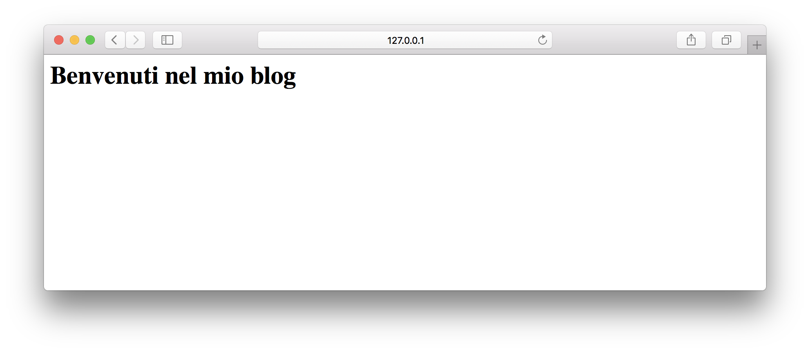

# 1. Setup ambiente di sviluppo

Per prima cosa, inziamo a creare un [virtualenv](../virtualenv.md) (io lo chiamerò `ludoblog`) e installiamoci all'interno `flask`.

```bash
$ virtuealenv ludoblog
$ cd ludoblog
$ source bin/activate
(ludoblog)$ pip install flask
(ludoblog)$ mkdir project && cd project
```

## Organizziamo il progetto
Per progetti grandi e per tenere il codice organizzato, conviene organizzare in modo organico il progetto all'interno di cartelle. Organizzerò il progetto seguendo delle [linee guida che si trovano su internet](http://flask.pocoo.org/docs/0.12/patterns/packages/).

La cartella `/project` sarà la cartella principale della nostra applicazione. Assicuriamoci di essere all'interno di questa cartella prima di iniziare a lavorare.

## Creiamo il modulo blog
Creiamo una cartella `blog` che conterrà la nostra applicazione, il file `blog/__init__.py` che sarà il core dell'applicazione.

```bash
(ludoblog)$ mkdir blog
(ludoblog)$ touch blog/__init__.py
```

Nota Bene: un file `__init__.py` in python assume un significato specifico: fa si che un progetto all'interno di una cartella sia considera un **modulo** python. Quindi ad ora in poi possiamo importare il modulo blog normalmente con la stringa `import blog`.

Aprimamo il file `blog/__init__.py` e andiamo ad implementare il seguente codice.

```python
from flask import Flask

def create_app():
    app = Flask(__name__)
    return app
```


## Creiamo il blueprint main

Flask permette di organizzare un'applicazione in sottoapplicazioni chiamate `blueprint`. I blueprint permettono di organizzare in modo organico la nostra app. Ad esempio, se un'applicazione contiene al proprio interno sia un blog che un forum, possiamo scorporarla in due `blueprint` per gestire, rispettivamente, il blog e il forum.

Personalmente, a me piace organizzare anche il core principale dell'applicazione (index, gestione errori, ecc.) all'interno di un blueprint chiamato `main`, che è quello che andremo a fare adesso. In questo modo, quando andremo a creare nuove applicazioni, possiamo fare un bel copia-incolla della cartella *main* e avremo già pronto tutte le varie parti di gestione.

Dobbiamo quindi creare una cartella `main` organizzata come segue all'interno della cartella `blog`.

```
main/
├── __init__.py
├── errors.py
└── views.py
```

#### File \_\_init\_\_.py
Qui dentro inseriremo il codice generale del nostro modulo. Principalmente quello che farà questo file in ogni modulo blueprint deve essere:

- Inizializzare il Blueprint
- importare il file `views.py`

Implementiamo quindi il seguente codice centro il file

```python
from flask import Blueprint

main = Blueprint('main', __name__)

from . import views, errors
```

A che serve importare i file `views` e `errors` alla fine del file? In questo modo, qualsiasi file importerà il modulo `main`, importerà automaticamente anche tutti i moduli importati dal file `__init__.py`, e quindi, in questo caso, anche questi file.

#### File views.py

Questo file conterrà tutte le `views` che il nostro modulo esporterà. Per il modomento, accontentiamoci semplicemente di creare una view che risponde all'url `/` con semplice linea di testo.

Implementiamo il seguente codice nel file

```python
from . import main

@main.route('/')
def index():
    return '<h1>Benvenuti nel mio blog</h1>'
```

Si noti che, invece che usare direttamente l'oggetto `app`, utilizziamo l'oggetto blueprint `main` per generare il route dell'url.

#### File errors.py

Questo file è simile al file views, ma ha lo scopo di gestire le views da rilasciare nel momento in cui si verificano degli errori all'interno dell'applicazione.

Gli errori che andremo a gestire sono tre:

 - `error 403 (permesso negato)`, che si verifica quando l'utente accede ad un percorso a cui non ha i permessi di accedere.
 - `error 404 (file non trovato)`, che si verifica quando l'utente accede ad un percorso che non esiste.
 - `error 500 (errore interno al server)`, che viene generato automaticamente quando si verifica un problema nel server.

In flask, possiamo settare delle views personalizzate in base al problema che si verifica. Per il momento, come su, accontentiamoci di ritornare semplicemente una linea di testo. Implementiamo il seguente codice nel file.

```python
from flask import render_template
from . import main

@main.app_errorhandler(403)
def forbidden(e):
    return 'errore 403 - Accesso Negato', 403

@main.app_errorhandler(404)
def page_not_found(e):
    return 'errore 404 - File non trovato', 404

@main.app_errorhandler(500)
def internal_server_error(e):
    return 'errore 500 - Errore interno al server', 500
```

### Colleghiamo il Blueprint all'applicazione principale

Il nostro modulo `main` è in una forma base per essere utilizzata. Apriamo il file `ludoblog/__init__.py` e aggiungiamo il seguente codice prima della riga `return app`.

```python
# ...
def create_all():
	# ...
	from .main import main as main_bp
	app.register_blueprint(main_bp)
	# ...
```

Con queste due linee di codice abbiamo registrato alla nostra applicazione il blueprint `main` appena creato.

## Utilizziamo flask-script per gestire l'applicazione

A questo punto, l'applicazione ha il minimo indispensabile per poter essere lanciata e funzionare. Per porterlo fare, però, abbiamo bisogno di creare fisicamente l'app (ricordiamo che abbiamo creato un metodo `create_app()` ma non un vero e proprio oggetto app. Per poter fare questo, basterebbe un semplice script con le seguenti linee di codice

```python
from ludoblog import create_app
app = create_app()
app.run()
```

Tuttavia, cerchiamo di fare le cose per bene ed utiliziamo un'estensione di flask chiamata flask-script. Questa estensione fornisce un utilissimo set di script shell per gestire la nostra applicazioni, che permettono di lanciare l'app in varie modalità e gestire il database. Quest'estensione sarà utilissima in seguito quando l'app diventerà più grande, quindi è importante integrarla subito all'interno del nostro progetto.

Prima di tutto, installiamo flask-script come segue

```bash
(ludoblog)$ pip install flask-script
```

Ritorniamo nella cartella principale `/project` e creiamo un file `manage.py`. Implementiamo all'interno del file il seguente codice

```python
#!/usr/bin/env python

from ludoblog import create_app
from flask_script import Manager

app = create_app()
manager = Manager(app)

if __name__ == '__main__':
    manager.run()
```

A questo punto, possiamo lanciare l'applicazione con il seguente comando

```bash
(ludoblog)$ python manage.py runserver
```

In alternativa, possiamo rendere il file `manage.py` eseguibile, con il comando

```bash
(ludoblog)$ chmod +x manage.py
```

E, da questo momento, possiamo lanciare l'applicazione semplicemente con il comando

```bash
(ludoblog)$ ./manage.py runserver
```
Una volta lanciata l'app, accediamo, da browser, all'indirizzo `http://127.0.0.1:5000` e il server risponderà come nella seguente immagine.



Note

Trovate tutto il codice sviluppato fino ad ora al seguente link <https://github.com/ludusrusso/ludoblog/tree/p1>
