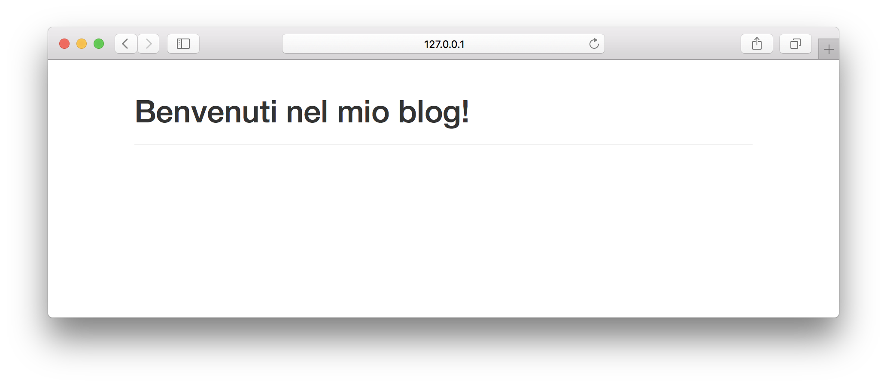
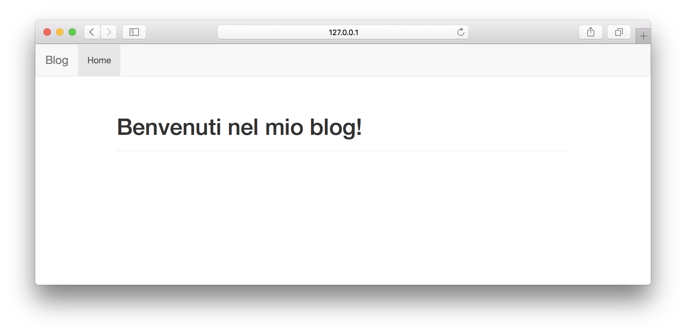
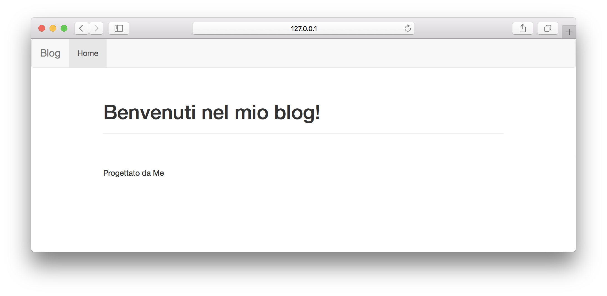

# 2. Diamo una veste grafica all'applicazione

Nel [tutorial precedente](./setup.md) abbiamo realizzato lo scheletro di un'applicazione funzionante. In questo secondo punto, organizzeremo la veste grafica della nostra app per poi iniziare a svilupparla.

## Templating

Per gestire graficamente l'app, utilizzeremo **Bootstrap**. **Bootstrap** è uno dei più popolari framework per lo sviluppo di interfacce grafiche web. Le sue peculiarità sono elencate qui sotto:

- *responsive*: cioè il framework si adatta automaticamente alle dimensioni dello schermo.
- *mobile first*: cioè è pensato principalmente per dispositivi mobili, ma funziona benissimo anche su classici desktop.
- *open source*. 

### Configurazione Flask-Boostrap

Flask-Bootstrap è un'estensione di flask che automaticamente ed in modo semplice importa bootstrap nella nostra applicazione e permette subito di usarlo. Andiamo quindi a crearlo e confingurarlo.

Per installare il pacchetto, utilizziamo (come al solito) il seguente comando.

```bash
(ludoblog)$ pip install flask-bootstrap
```
Perfetto, a questo punto andiamo ad inizializzarlo nella nostra applicazione.
Apriamo il file `blog/__init__.py` ed aggiungiamo le seguenti linee di codice

```python
# ...
from flask_bootstrap import Bootstrap

bootstrap = Bootstrap()

def create_app():
    app = Flask(__name__)
    # ...
    bootstrap.init_app(app)
    # ...
    return app
```

Perfetto, a questo punto siamo pronti per iniziare a sviluppare la nostra interfaccia grafica.

### Creiamo un Template Base

La prima cosa da fare è creare un template che useremo come base per tutte le nostre pagine. Questo template, quindi, deve contenere gli elementi principali che si ripeteranno poi in ogni pagina della nostra webapp, come il navbar o il footer. Iniziamo a creare adesso un template base essenziale e poi andremo, piano piano, ad arricchirlo. La cosa bella è che, una volta creato un template base e ricordandoci di far derivare ogni altra pagina web da questo template (vedremo dopo come fare), ogni aggiunta e miglioria al template base apparirà anche nelle altre pagine.

Creiamo due cartella `templates/main` all'interno del blueprint `main` e un file  `base.html` all'interno di questa cartella

```bash
(ludoblog)$ mkdir blog/main/templates
(ludoblog)$ mkdir blog/main/templates/main
(ludoblog)$ touch blog/main/templates/main/base.html
```

Adesso andiamo ad implementare il template base, apriamo il file appena creato e mettiamo dentro il seguente codice.

```html

Blog


	<div class="container">
		<div class="row">
			<div class="col-lg-12">
			 	
    			
			</div>
		</div>
	</div>

```

Perfetto, addesso siamo pronti ad usare il nostro template per costruire le view dell'applicazione!

### Pagina principale

Per prima cosa, abbiamo bisogno di informare il blueprint `main` su dove trovare i template che andremo ad utilizzare. Per fare questo, modifichiamo, nel file `blog/main/__init__.py` la linea di codice

```python
main = Blueprint('main', __name__)
```

con la seguente

```python
main = Blueprint('main', __name__, template_folder="templates")
```

In questo modo, informiamo il blueprint di cercare i template all'interno della cartella `blog/main/templates`.

Adesso possiamo creare un semplice template da visualizzare nell'index. Creiamo un nuovo file `blog/main/templates/main/index.html` e andiamo ad implementare il seguente codice html

```html



	<div class="page-header">
	  <h1>Benvenuti nel mio blog!</h1>
	</div>

```

Perfetto! A questo punto non ci resta che richiamare il template nella view `index`. Modifichiamo il file `views.py`, ed in particolare la funzione `index()` come segue

```python
from . import main
from flask import render_template

@main.route('/')
def index():
    return render_template('main/index.html')
```

Lanciamo l'applicazione e accediamo alla webapp da browser.



### Pagine di errore

Creiamo adesso un template simile per gestire le pagine di errore. Quello devono fare queste pagine sarà semplicemente visualizzare il codice di errore e le informazioni all'interno di una veste grafica ben costruita.

Siccome le 3 pagine di errore dovranno essere graficamente identiche, a parte le stringhe da visualizzare, ho pensato di creare una pagina unica per renderizzarle e di utilizzare delle variabili per visualizzare stringhe diverse in base all'errore generato. In particolare, la pagina dovrà visualizzare con il tag `h1` il codice di errore e con il tag `h2` il messaggio di errore. Andiamo quindi a creare un secondo template `blog/main/templates/main/error.html` e inseriamo dentro il seguente codice html

```html



	<div class="page-header">
	  <h1> Errore {{ error_code }}</h1>
	  <h2>{{ error_msg }}</h2>
	</div>

```
Perfetto, a questo punto non dobbiamo fare altro che passare le due variabili `error_code` e `error_msg` al nostro template per generare pagine diverse.

Modifichiamo il file `blog/main/errors.py` come segue

```python
from flask import render_template
from . import main

@main.app_errorhandler(403)
def forbidden(e):
    return render_template('main/error.html', error_code=403, error_msg="Accesso negato!"), 403

@main.app_errorhandler(404)
def page_not_found(e):
    return render_template('main/error.html', error_code=404, error_msg="File non trovato!"), 404

@main.app_errorhandler(500)
def internal_server_error(e):
    return render_template('main/error.html', error_code=500, error_msg="Errore interno al server!"), 500
```
Testiamo la nostra app accedendo ad un URL non esistente, ad esempio `/error` e dovremmo veder generaro l'errore 404.

## NavBar e Footer

La barra di navigazione e il footer sono due parti importanti di un qualsiasi sito web, e quindi anche della nostra webapp. Entrambi riguardano tutte le views del blog, quindi le implementermo nel template base.

### NavBar

Per implementare la navbar, ci viene in aiuto la comoda estensione di flask chiama flask-nav. Essenzialmente, flask-nav permette di creare NavBar in modo dinamico ogni volta che una view viene generata, ed si integra con flask-bootstrap per la visualizzazione.

Iniziamo ad installare il pacchetto flask-nav

```bash
pip install flask-nav
```

A questo punto, possiamo iniziare ad impostare la nostra navbar. Per prima cosa, inizializziamo il modulo all'interno del file `blog/__init__.py`:

```python
# ...
from flask_nav import Nav
# ...
nav = Nav()

def create_app():
    # ...
    nav.init_app(app)
    # ...
    return app
```


Creiamo quindi un file chiamato `blog/nav.py` e inseriamoci il seguente codice

```python
from . import nav
from flask_nav.elements import *

@nav.navigation()
def main_nav():
    navbar = Navbar('Blog')
    navbar.items.append(View('Home', 'main.index'))
    return navbar
```

Ricordiamoci di aggiugnere la stringa

```python
from .nav import main_nav
```
Alla fine del file `blog/__init__.py`. In modo che il file `blog/nav.py` venga importato correttamente.

La navbar che abbiamo realizzato è molto semplice, la complicheremo quando andremo ad arricchire il blog. L'ultimo passo però consiste nel renderizzarla. Apriamo il file `blog/main/templates/main/base.html` e aggiungiamo queste linee di codice per renderizzare la barra.

```html

{{nav.main_nav.render()}}

```

Perfetto, a questo punto possiamo lanciare l'applicazione che mostrerà la nostra navbar!



### Footer

Come per la navbar, il footer deve essere visualizzato in tutte le views della nostra applicazione. Per questo motivo, anche questo va inserito all'interno del templeta base. A differenza della navbar che deve essere dinamica, il footer deve contenere semplicemente informazioni generali di un sito, come il nome dell'autore, le finalità, link a social networks e alla privacy policy, ecc. Per il momento, di nuovo, lo renderò minimale, ma ognuno può customizzarlo come vuole.

Per aggiungere il footer, modifichiamo il file `blog/main/templates/main/base.html` come segue

```html
#...


	#...

  <footer>
    <hr>
    <div class="container">
      <div class="row">
        <div class="col-lg-12">
          Progettato da Me
        </div>
  		</div>
  	</div>
  </footer>

```

E riavviamo l'applicazione.



> Trovate tutto il codice sviluppato fino ad ora al seguente link <https://github.com/ludusrusso/ludoblog/tree/p2>